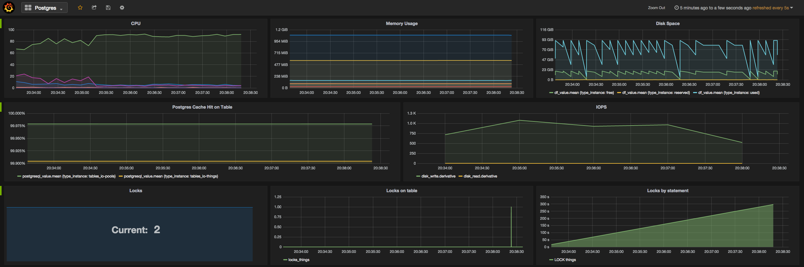

# pg-monitoring
A collection of useful scripts to query postgres statistics.
These scripts are optimized so that it can be seamlessly used with time series storage and visualization software
(e.g. [Influxdb](https://influxdata.com/) + [Grafana](http://grafana.org/)) to obtain something like

## Statistics

| Collection | Type | Metrics | Suggested Reading |
| ---- | ---- | ---- | --- |
| [Activities](activities/) | Connections | count , states, lock queue size | |
| [Locks](locks/) | Connections, Relations, Statements | count | [Lock Monitoring](https://wiki.postgresql.org/wiki/Lock_Monitoring) |
| [Tables](tables/) | IO | cache hit percentage ||

## General Materials

- [Offical Documentation](http://www.postgresql.org/docs/current/static/monitoring-stats.html)
- [PostgreSQL Monitoring Cheatsheet](https://russ.garrett.co.uk/2015/10/02/postgres-monitoring-cheatsheet/) by Russ Garrett
- [Some PostgreSQL statistics queries](https://gist.github.com/ruckus/5718112) by ruckus
